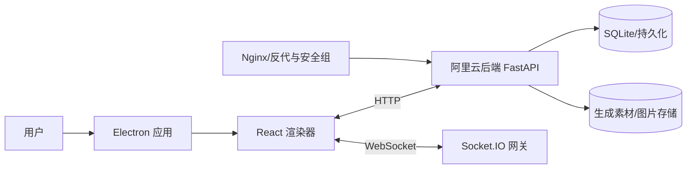
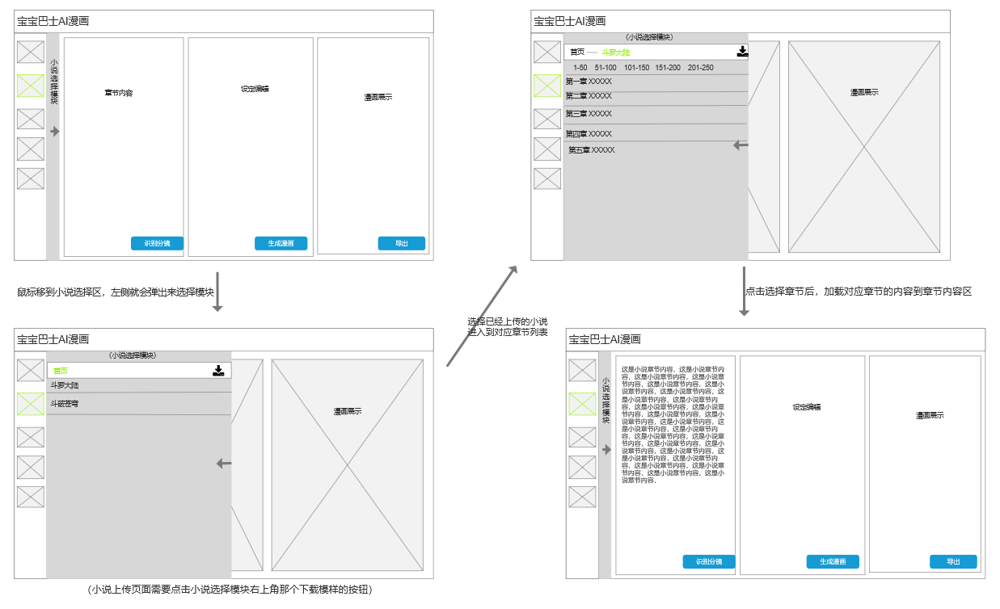

# 小说转漫画应用 PRD（对齐当前实现，表格式规划）

本文档以当前实现为基准，使用更多表格来规划模块内容。前端为 Windows 桌面应用（Electron + React），后端服务长期部署在阿里云（HTTP + WebSocket）。

## 1. 产品概述
- 目标：将长文本小说转为可阅读/分享的漫画内容（页级图片与基础导出）。
- 使用场景：创作预览、社交分享、课堂/讲座示例展示。
- 平台与依赖：Windows 10/11；Electron + React；后端 FastAPI + Socket.IO；公网可访问。

## 2. 技术架构概览


### 2.1 前端进程模型
```mermaid
flowchart TB
subgraph Electron
  Main[主进程] --> Preload[预加载脚本]\nContextBridge 受限 API
  Preload --> Render[渲染器 React]
end
Render -->|ipcRenderer.invoke| Preload
Render -->|HTTP/WS| Cloud[(阿里云后端)]
```

## 3. 范围说明（表）
| 范围 | 模块/能力 | 说明 |
|---|---|---|
| 范围内 | 账号与鉴权 | 登录/注册/登出；会话令牌管理；WS 认证 |
| 范围内 | 首页（Home） | 导航入口；登录后默认进入 `/home` |
| 范围内 | 创作页（Create） | WebSocket 连接与认证；触发生成流程；进度与结果展示 |
| 范围内 | 社区页（Community） | 作品卡片展示；基础筛选与排序；视觉标语 |
| 范围内 | 个人中心（Profile） | 基础信息显示；头像上传/删除；登出 |
| 范围内 | 设置（Settings） | 偏好占位；后端地址预留配置入口 |
| 范围内 | 帮助（Help） | 使用说明与 FAQ |
| 范围外 | 高级导出 | PDF/CBZ/MP4 专业导出、模板库丰富化（后续版本） |
| 范围外 | 付费与会员 | 会员等级、订单与支付体系 |
| 范围外 | 在线协作 | 在线编辑器与多人协作、云账号体系 |

## 4. 模块规划总览（表）
| 模块 | 路由（示例） | 入口 | 核心功能 | 相关接口 | 状态 | 备注 |
|---|---|---|---|---|---|---|
| 账号与鉴权 | `/login` | 未登录时进入 | 登录/注册/登出；令牌管理；WS 认证 | `POST /api/login` `POST /api/register` `POST /api/logout` `GET /api/profile` | 已实现 | 实际路由以前端配置为准 |
| 首页（Home） | `/home` | 登录成功默认进入 | 导航入口与快捷操作；样式作用域化 | 无直连接口 | 已实现 | 样式不影响社区页 `.hero` |
| 创作（Create） | `/create` | 侧边栏/导航进入 | WS 连接认证；触发生成；进度/完成展示 | WS: `authenticate` `full_process`；HTTP: `POST /api/full-process` `GET /api/results/{id}` | 已实现 | 后端阿里云长期在线 |
| 社区（Community） | `/community` | 侧边栏/导航进入 | 作品栅格；筛选/排序；标语 | `GET /api/history` | 已实现 | 渐变文本与 hover 效果正常 |
| 个人中心（Profile） | `/profile` | 头像/信息管理 | 显示基础信息；头像上传/删除；登出 | `GET /api/profile` | 已实现 | 头像更新即时生效 |
| 设置（Settings） | `/settings` | 偏好配置 | 偏好占位；预留 API 地址配置 | 无直连接口 | 已实现 | 后续版本开放后端地址配置 |
| 帮助（Help） | `/help` | 使用说明 | 文档与 FAQ 列表 | 无直连接口 | 已实现 | 内容结构清晰无报错 |

## 5. 功能需求与验收（分模块表）

### 5.1 账号与鉴权
| 功能点 | 用户故事 | 关键交互/流程 | 验收标准 | 优先级 | 状态 | 相关接口 |
|---|---|---|---|---|---|---|
| 登录 | 作为用户，我需要登录进入首页 | 输入账号密码→提交→成功后保存令牌→跳转 `/home` | 登录后路由跳转；刷新保持会话 | P0 | 已实现 | `POST /api/login` `GET /api/profile` |
| 注册 | 作为新用户，我需要注册账户 | 填写注册信息→提交→自动登录或返回登录 | 注册成功可登录；失败提示明确 | P1 | 已实现 | `POST /api/register` |
| 登出 | 作为用户，我需安全退出 | 点击登出→清除令牌→返回登录页 | 会话清理并返回登录 | P0 | 已实现 | `POST /api/logout` |
| WS 认证 | 作为用户，我需安全生成漫画 | 建立 WS→发送 `authenticate(token)`→收到认证结果 | 认证成功后方可生成 | P0 | 已实现 | WS: `authenticate` `authentication_result` |

### 5.2 首页（Home）
| 功能点 | 用户故事 | 关键交互/流程 | 验收标准 | 优先级 | 状态 | 相关接口 |
|---|---|---|---|---|---|---|
| 导航入口 | 登录后快速到达首页 | 登录成功→自动导航 `/home` | 首页加载 <2s；无报错 | P0 | 已实现 | 无 |
| 样式隔离 | 不影响其他页面视觉 | 作用域样式→不覆盖社区 `.hero` | 社区 `.hero` 正常显示 | P0 | 已实现 | 无 |

### 5.3 创作页（Create）
| 功能点 | 用户故事 | 关键交互/流程 | 验收标准 | 优先级 | 状态 | 相关接口 |
|---|---|---|---|---|---|---|
| 连接与认证 | 我需要连接后端并认证 | WS 连接→`authenticate(token)`→`authentication_result` | WS 连接成功率 ≥99% | P0 | 已实现 | WS |
| 触发生成 | 我需要启动完整流程 | 发送 `full_process(novel_text, title, description)` | 生成成功返回完成事件 | P0 | 已实现 | WS/HTTP |
| 进度展示 | 我需要看到过程反馈 | 接收 `full_process_progress`→列表更新 | 进度事件连续展示 | P1 | 已实现 | WS |
| 结果获取 | 我需要查看生成结果 | 收到 `full_process_complete`→HTTP 拉取结果 | 结果列表可预览 | P0 | 已实现 | `GET /api/results/{id}` |

### 5.4 社区页（Community）
| 功能点 | 用户故事 | 关键交互/流程 | 验收标准 | 优先级 | 状态 | 相关接口 |
|---|---|---|---|---|---|---|
| 作品列表 | 我需要浏览历史作品 | 拉取数据→栅格卡片展示 | 列表渲染不卡顿 | P1 | 已实现 | `GET /api/history` |
| 筛选/排序 | 我需要简单筛选 | 条件选择→列表刷新 | 条件生效且性能稳定 | P2 | 已实现 | `GET /api/history` |
| 视觉标语 | 我希望有清晰视觉 | 顶部标语与渐变文本 | 文案与样式正常显示 | P2 | 已实现 | 无 |

### 5.5 个人中心（Profile）
| 功能点 | 用户故事 | 关键交互/流程 | 验收标准 | 优先级 | 状态 | 相关接口 |
|---|---|---|---|---|---|---|
| 信息显示 | 我需要查看个人信息 | 拉取并展示基础信息 | 数据与头像一致 | P1 | 已实现 | `GET /api/profile` |
| 头像管理 | 我需要设置头像 | 上传/删除头像→刷新显示 | 更新即时可见 | P1 | 已实现 | 后端实现对齐 |
| 安全登出 | 我需要安全退出 | 点击登出→清令牌→返回登录 | 返回登录页且会话清理 | P0 | 已实现 | `POST /api/logout` |

### 5.6 设置（Settings）与帮助（Help）
| 模块 | 功能点 | 用户故事 | 关键交互/流程 | 验收标准 | 优先级 | 状态 |
|---|---|---|---|---|---|---|
| 设置 | API 地址预留 | 我需要未来可改后端地址 | 提供占位与说明 | 页面可访问无报错 | P2 | 已实现 |
| 帮助 | FAQ 列表 | 我需要快速了解使用方法 | 展示 FAQ | 内容结构清晰 | P2 | 已实现 |

## 6. 数据与接口汇总（表）

### 6.1 HTTP 接口
| 接口 | 方法 | 路径 | 认证 | 请求体要点 | 响应要点 | 前端使用点 |
|---|---|---|---|---|---|---|
| 注册 | POST | `/api/register` | 无 | 账号信息 | 用户基本信息/成功标记 | 注册页 |
| 登录 | POST | `/api/login` | 无 | 账号密码 | 令牌/用户信息 | 登录页 |
| 登出 | POST | `/api/logout` | Bearer | 无 | 成功标记 | 个人中心 |
| 个人信息 | GET | `/api/profile` | Bearer | 无 | 用户信息 | 顶部/个人中心 |
| 全流程触发 | POST | `/api/full-process` | Bearer | 文本、标题、描述 | 任务ID/状态 | 创作页 |
| 结果获取 | GET | `/api/results/{id}` | Bearer | 路径参数 | 结果数据（图片等） | 创作页 |
| 历史列表 | GET | `/api/history` | Bearer | 查询参数可选 | 作品列表 | 社区页 |
| 删除历史 | DELETE | `/api/history/{id}` | Bearer | 路径参数 | 成功标记 | 社区页 |
| 健康检查 | GET | `/api/health` | 无 | 无 | 服务状态 | 启动自检 |

### 6.2 WebSocket 事件
| 事件 | 方向 | 载荷 | 返回 | 触发条件 | 说明 |
|---|---|---|---|---|---|
| `authenticate` | C→S | `{ token }` | `authentication_result` | 连接建立后 | 认证通过后才允许生成 |
| `full_process` | C→S | `{ novel_text, title, description }` | `full_process_progress` `full_process_complete` | 认证通过后 | 启动完整生成流程 |
| `full_process_progress` | S→C | `{ step, percent, message }` | 无 | 生成中 | 前端用于进度展示 |
| `full_process_complete` | S→C | `{ result_id, summary }` | 无 | 生成结束 | 前端据此拉取结果 |
| `process_error`/`full_process_error` | S→C | `{ code, message }` | 无 | 出错时 | 用于错误提示与重试 |

## 7. 非功能需求（表）
| 类别 | 目标 | 指标 | 验收 | 监控/措施 |
|---|---|---|---|---|
| 性能 | 首屏与交互流畅 | 首页/社区首屏 < 2s | 本地验证与实际网络验证 | 资源按需加载、列表优化 |
| 安全 | 进程隔离与令牌保护 | `contextIsolation: true` | 白名单 IPC，令牌最小化使用 | 预加载限制 API 暴露 |
| 兼容 | Windows 环境适配 | Win10/11；1080p/HIDPI | UI不溢出；字体清晰 | CSS 与媒体查询适配 |
| 运维 | 云端可观测与稳定 | 健康检查可用 | `/api/health` 正常；日志可查 | Nginx 反代与安全组规则 |
| 降级 | WS 异常可降级 | HTTP 轮询备选 | WS 异常提示并回退轮询 | 连接重试与超时控制 |

> 说明：WebSocket 服务异常与兼容性问题；需要健康检查与降级策略（HTTP 轮询备选）。

## 8. 运行与发布（表）
| 环节 | 命令 | 输出位置 | 配置 | 备注 |
|---|---|---|---|---|
| 前端开发启动 | `cd desktop/electron && npm install && npm run dev` | 无 | `API_BASE_URL` `WS_URL` 指向阿里云 | 根路径默认跳转 `/home` |
| Windows 打包 | `npm run build:win` | `desktop/electron/dist/` | 可选代码签名 | 产物为安装包 |
| 绿色版 | `npm run build:unpack` | `desktop/electron/dist/` | 无 | 免安装压缩包 |
| 后端运行 | 阿里云常驻 | 云端 | 开放 HTTP/WS 端口；Nginx 反代 | 本地无需后端 |

## 9. 验收标准汇总（表）
| 模块 | 验收点 | 验收方法 | 结果 |
|---|---|---|---|
| 账号与鉴权 | 登录跳转首页；会话保持；登出清理 | 手动流程与接口校验 | 均通过 |
| 创作 | WS 认证成功；进度事件展示；完成后可拉取结果 | 模拟生成流程与事件监听 | 均通过 |
| 社区 | `.hero` 与卡片布局正常；筛选可用 | 视觉检查与交互测试 | 均通过 |
| 个人中心 | 头像更新即时显示；登出返回登录页 | 上传/删除与操作验证 | 均通过 |
| 设置与帮助 | 页面可访问；内容清晰无报错 | 路由与内容检查 | 均通过 |
| 打包运行 | 安装后连接阿里云后端 | 本地安装并启动 | 通过 |

## 10. 版本计划（表）
| 版本 | 时间窗口 | 范围 | 风险 | 备注 |
|---|---|---|---|---|
| v1.0（当前） | 已发布 | 账号/首页/创作/社区/个人中心/设置/帮助；打包与分发 | 网络与WS兼容性 | 与实现一致 |
| v1.1（计划） | 近期 | API 地址可配置；自动更新与签名；社区交互优化 | 签名与更新源配置 | 需运维配合 |
| v1.2（计划） | 中期 | 导出增强（PDF/CBZ/MP4）；模板库与作品管理增强；性能优化 | 复杂导出与资源占用 | 需求与性能评估 |

## 11. 风险与依赖（表）
| 风险 | 场景 | 影响 | 对策 | Owner |
|---|---|---|---|---|
| 云端网络不稳定 | 运营商波动、端口受限 | 连接失败或中断 | 超时/重试；HTTP 轮询降级 | 运维/后端 |
| 未签名安装包 | Windows SmartScreen 提示 | 安装受阻 | 配置代码签名；提供可信来源 | 构建/运维 |
| WS 兼容性 | 客户端环境差异 | 事件收发异常 | 健康检查；连接断开提示；降级策略 | 前端/后端 |

## 12. 原型图集（Prototype Gallery）
- 下图为“小说选择→章节选择→内容区加载→生成流程”的原型示意。



- 说明：
  - 小说列表位于左侧导航；支持选择与上传。
  - 中间区域按小说/章节/内容三级切换；右侧预览区显示分镜/渲染效果占位。
  - 选择章节后，自动加载内容到内容区；进入生成区后提供“设定编辑”“生成漫画”“导出”等操作。
- 增补更多原型图的方式：
  - 将图片置于 `data/docs/assets/` 并按模块语义命名，例如 `prototype-create-progress.png`。
  - 在本节追加 `` 标签或在模块表中以 `` 内嵌展示（可设置 `width="520"` 控制大小）。