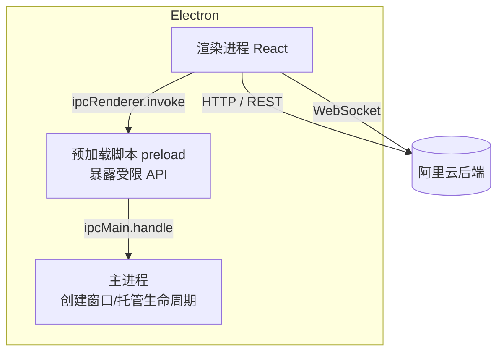
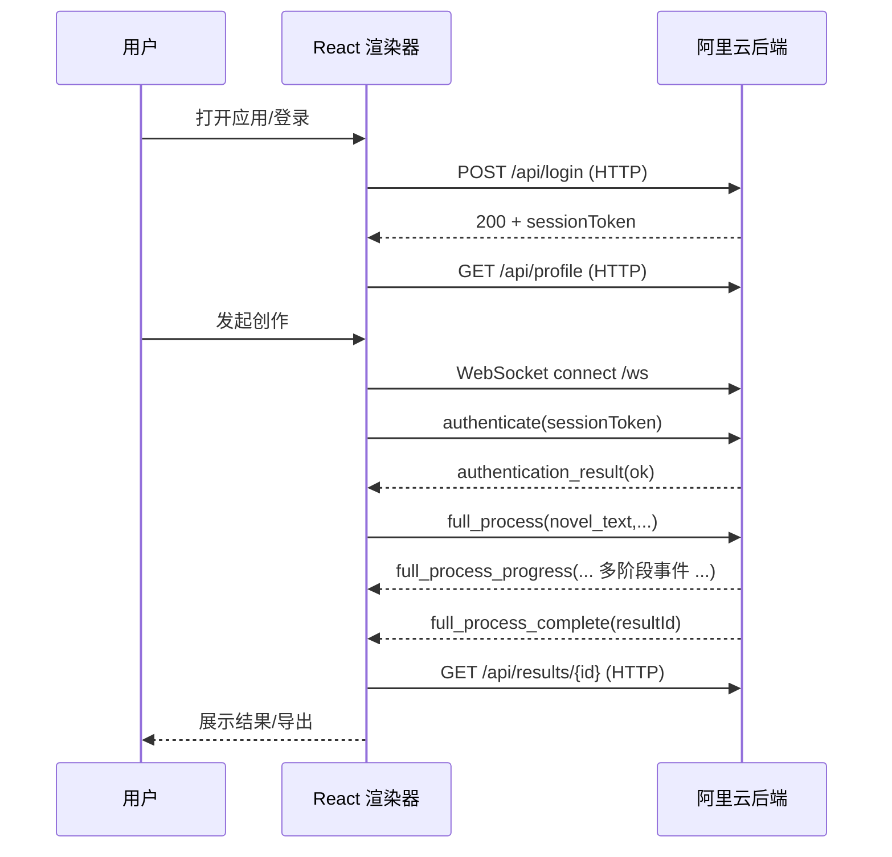

# Babybus 小说转漫画应用

宝宝巴士小组-七牛云产研秋招参赛项目
一个将小说文本转为漫画的桌面应用。前端基于 Electron + React，后端基于 Python，已部署在阿里云服务器并长期运行，通过 HTTP 与 WebSocket 向客户端提供服务。
demo演示视频链接：【大学生5天开发AI漫画应用demo——七牛云秋招产研比赛 宝宝巴士小组作品demo演示】 https://www.bilibili.com/video/BV1jSxPzdECw/?share_source=copy_web&vd_source=6a384f9535af189ae6cbb6a77b166f91
应用测试账号：  id：111   密码：111111

**组内分工**
- 吴文凡 Kris（产品分析、创作流程、结果展示、前端开发、服务器部署）
- 李锦堃（负责 FastAPI 服务、Socket.IO 事件流、数据库设计、接口测试、后端开发）

**核心特性**
- 桌面端：Electron + React + Vite（electron-vite），路由含首页、创作、社区、个人中心、帮助、设置。
- 后端：Python（FastAPI/Socket.IO），提供鉴权、创作流程编排、资源管理，运行在阿里云。
- 数据流：登录鉴权（HTTP）、创作流程（WebSocket 事件流）、结果拉取（HTTP）。
- 发行：支持打包 Windows 安装包（NSIS）与绿色版，跨平台按需在对应系统打包。

---

## 技术架构

### 总体架构
```mermaid
flowchart LR
U[用户] --> E[Electron 应用]
E --> R[React 渲染器]\n(Home/Create/Community/Profile/Settings)
E --> P[Preload\nContextBridge 受限 API]
R <-->|HTTP/WS| B[后端服务\n(阿里云 FastAPI + Socket.IO)]
B --> DB[(数据库/SQLite)]
B --> ST[(素材/生成资源存储)]
CDN[静态资源/CDN] --> R
Nginx[Nginx/反向代理] --> B
```

### 前端架构（Electron 进程模型）


### 数据流转架构（含鉴权与创作流程）


---

## 运行与体验

后端已部署在阿里云并持续运行，普通用户无需本地搭建后端。你可以选择“开发模式”或“打包安装”的方式体验。

### 开发模式（Windows）
- 前提：安装 Node.js 18+（建议 20+）与 npm。
- 命令：
  - `cd desktop/electron`
  - `npm install`
  - `npm run dev`
- 打开开发应用，默认根路径会跳转到 `/home`。登录成功后进入首页；创作页面使用 WebSocket 与云端后端通信。

### 生产打包与分发
- Windows 安装包：`cd desktop/electron && npm run build:win`
  - 产物：`desktop/electron/dist/electron-app-<version>-setup.exe`
  - 分发：将安装包发给用户，双击安装即可使用。
- 绿色版（免安装目录）：`npm run build:unpack`
  - 产物：`dist/win-unpacked/`，压缩后分发，解压后直接运行。
- macOS/Linux：需在对应平台打包（`npm run build:mac` / `npm run build:linux`）。

### 后端地址与配置
- 前端通过代码或配置使用云端地址（HTTP/WS）。请确保：
  - 所有请求的 `API_BASE_URL` 与 `WS_URL` 指向阿里云公网可访问地址。
  - 防火墙与安全组已开放相应端口。
- 如需改动地址，建议在 `src/renderer/src/config.ts` 或 `.env` 中统一管理，再在渲染器引用。

---

## 主要功能
- 登录/注册、个人中心与头像管理。
- 首页导航与创作入口，社区页作品展示与筛选。
- 创作流程：上传或输入小说文本 → 云端分镜与图像生成 → 结果展示与导出。
- 设置与帮助页面：基础偏好与操作指南。

---

## 目录结构
- `backend/`：Python 后端（FastAPI/Socket.IO、云端部署版本）。
- `desktop/electron/`：Electron + React 前端工程。
- `data/`：本地数据与示例素材。
- `docs/` 与根文档：`ARCHITECTURE.md`、`RUNNING.md` 等。

---

## 开发说明（前端）
- 依赖：React 19、React Router 7、Zustand、Vite、electron-vite、electron-builder。
- 常用脚本：
  - `npm run dev`：本地开发（热更新）。
  - `npm run build`：构建 Electron 资源。
  - `npm run build:win`：打包 Windows 安装包。

---

## 发布与更新（可选进阶）
- 代码签名：为安装包配置证书，提升可信度，减少 SmartScreen 阻拦。
- 自动更新：结合 `electron-updater` 与发布源（GitHub Releases/对象存储/CDN），在 `electron-builder.yml` 的 `publish` 段设置实际地址。

---

## 常见问题
- 安装包被拦截：未签名安装包可能触发 Windows SmartScreen，选择“仍要运行”或为安装包签名。
- 连接失败：检查云端地址是否正确、端口是否放行、网络是否可达。
- 白屏或样式错乱：清缓存后重试，或确保首页样式已作用域化（已修复）。

---

## 许可证
- 本项目用于学习与演示，若用于商业请自行评估合规与版权。


